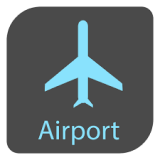
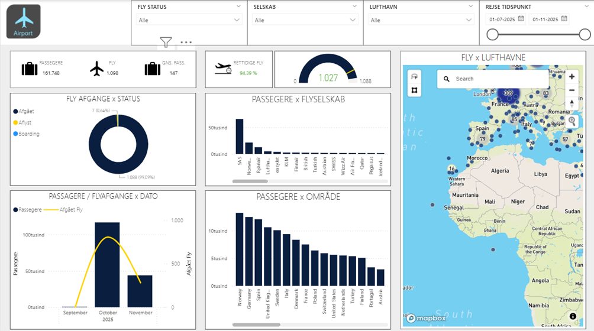
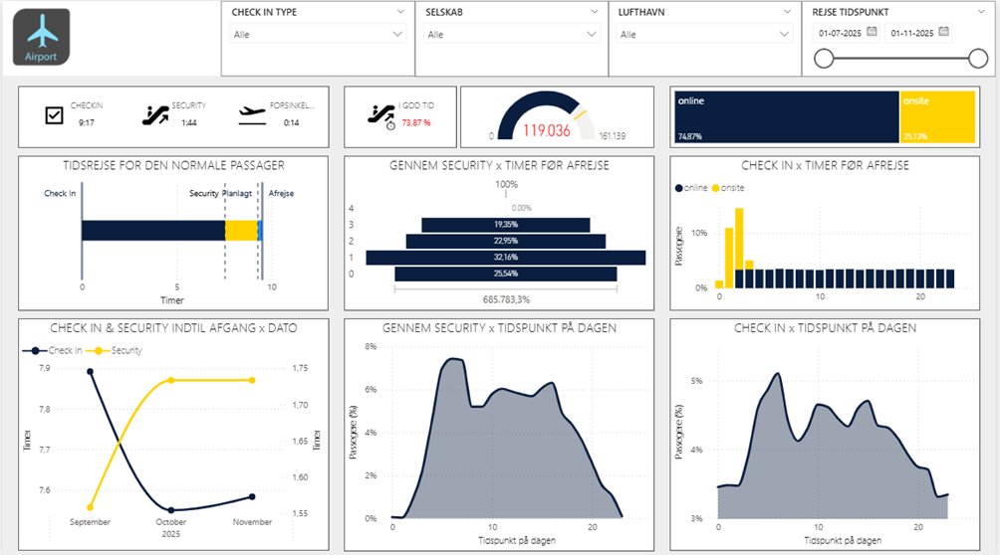
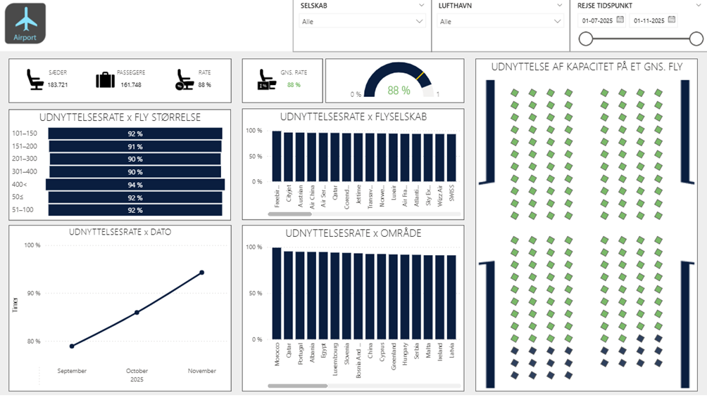

  <section class="hero">
    

      

        
Airport Case / Data Engineering / Power BI

        <h1>AIRPORT</h1>
        

          En end-to-end data- og rapporteringsloesning, der kombinerer simulerede passagerdata,
          eksterne flydata og en Power BI-rapport i et samlet, versionsstyret projekt.
        

        

          <a class="button primary" href="./Abrahim_Borgi_AIRPORT_Simulation_Project.pdf">Laes rapporten</a>
          <a class="button secondary" href="https://github.com/AbrahimBorgiPrivat/AIRPORT">Se repository</a>
        

        

          Projektet er udviklet som en realistisk airport-case uden adgang til interne systemer
          eller rigtige passagerdata. Fokus er derfor baade teknisk pipeline, datamodel og
          beslutningsstoettende rapportering.
        

      

      

        

          

            
            

              <strong style="display:block; color:#15284b;">Power BI Demo</strong>
              Overblik over drift, flow og kapacitet
            

          

          
        

      

    

    

      

        <strong>4</strong>
        Docker-baserede ETL-services
      

      

        <strong>3</strong>
        Rapportsider i Power BI
      

      

        <strong>1</strong>
        Semantisk model med Tabular-assets
      

      

        <strong>E2E</strong>
        Fra datakilde til visualisering
      

    

  </section>

  <nav class="quick-nav" aria-label="Sektioner">
    <a class="chip" href="#overblik">Overblik</a>
    <a class="chip" href="#forretningsmaal">Forretningsmaal</a>
    <a class="chip" href="#arkitektur">Arkitektur</a>
    <a class="chip" href="#datagrundlag">Datagrundlag</a>
    <a class="chip" href="#rapport">Power BI</a>
    <a class="chip" href="#stack">Teknologier</a>
    <a class="chip" href="#struktur">Repository</a>
  </nav>

  <section class="section panel alt" id="overblik">
    
Executive Summary

    <h2>Et BI-projekt bygget som en rigtig leverance</h2>
    

      

        <h3>Projektets pointe</h3>
        

          AIRPORT viser, hvordan man kan bygge en trovaerdig analyse- og rapporteringsloesning
          under praktiske begraensninger: uden adgang til interne driftskilder, men stadig med et
          klart forretningsmaal og et professionelt output.
        

      

      

        <h3>Det du ser i projektet</h3>
        <ul>
          <li>Simulation af passagerer, billetter og timing omkring check-in og security</li>
          <li>Indlaesning af flyafgange, lufthavnsmetadata og flymodeller</li>
          <li>PostgreSQL-tabeller, views og upsert-logik til genkoerbar dataload</li>
          <li>PBIP-projekt med semantisk model, DAX og interaktive dashboards</li>
        </ul>
      

    

  </section>

  <section class="section panel" id="forretningsmaal">
    
Formaal

    <h2>Hvilke spoergsmaal projektet skal kunne besvare</h2>
    

      

        <h3>Operationelt overblik</h3>
        <ul>
          <li>Hvor mange passagerer og afgange er haandteret i perioden?</li>
          <li>Hvor stor en andel af flyene afgaar rettidigt?</li>
          <li>Hvilke selskaber, destinationer og tidspunkter driver belastningen?</li>
        </ul>
      

      

        <h3>Flow og kapacitet</h3>
        <ul>
          <li>Hvornar checker passagerer ind og passerer security?</li>
          <li>Hvor mange kommer igennem i god tid?</li>
          <li>Hvor godt udnyttes flyenes saedekapacitet?</li>
        </ul>
      

    

  </section>

  <section class="section panel alt" id="arkitektur">
    
Arkitektur

    <h2>Loesningen er bygget i tydelige lag</h2>
    

      

        

          
1

          

            <h3>Datakilder</h3>
            

              Projektet kombinerer syntetiske data, API-data og JSON-referencefiler for at skabe
              et analyseunivers, der ligner virkelige airport-scenarier.
            

          

        

      

      

        

          
2

          

            <h3>ETL-services</h3>
            

              Fire Docker-services haandterer ingestion, simulation, tabeloprettelse og view-logik,
              saa loesningen kan koeres og opdateres kontrolleret.
            

          

        

      

      

        

          
3

          

            <h3>Datamodel</h3>
            

              PostgreSQL anvendes til relationel lagring af flights, passports, ticket-data,
              aircraft_models, airports og datodimensioner.
            

          

        

      

      

        

          
4

          

            <h3>Semantisk model og rapport</h3>
            

              Power BI, PBIP og Tabular Editor binder det hele sammen i en rapport, der er nem at
              laese og stadig teknisk veldokumenteret.
            

          

        

      

    

  </section>

  <section class="section panel" id="datagrundlag">
    
Datagrundlag

    <h2>Syntetiske data, eksterne kilder og praktisk modellering</h2>
    

      

        <h3>Simulationer</h3>
        

          Passagerer, pasnumre, nationaliteter, check-in-type, check-in-tider og security-passager
          bliver genereret i Python for at skabe et plausibelt operationelt flow.
        

      

      

        <h3>Eksterne data</h3>
        

          Historiske flyafgange og lufthavnsmetadata giver projektet et realistisk anker, saa
          dashboards ikke kun bygger paa antagelser.
        

      

      

        <h3>Referencefiler</h3>
        

          Flymodeller og kapacitetsdata fra JSON goer det muligt at analysere belaegning,
          flystoerrelser og udnyttelsesrater paa tværs af afgange.
        

      

    

    

      

        <h3>Centrale tabeller</h3>
        <ul>
          <li><code>PASSPORTS</code> med passageridentitet og land</li>
          <li><code>FLIGHTS</code> med status, destination, gate og tider</li>
          <li><code>FLIGHT_TICKETS</code> med saede, check-in-type og tidsstempler</li>
          <li><code>AIRCRAFT_MODELS</code> med saeder, producent og kodevaerdier</li>
          <li><code>AIRPORTS</code> og <code>DATEVIEW</code> som reference- og analysedata</li>
        </ul>
      

      

        <h3>Hvorfor simulation giver mening her</h3>
        

          Billet- og passagerdata er med vilje syntetiske. Det giver et sikkert og kontrolleret
          setup, hvor man stadig kan demonstrere realistiske moenstre, kapacitetsudfordringer og
          analytiske KPI'er uden at arbejde med foelsomme driftsdata.
        

      

    

  </section>

  <section class="section panel alt" id="rapport">
    
Power BI Report

    <h2>Tre dashboards med hver sit fokus</h2>
    

      <article class="report-card">
        
        

          <h3>Side 1: Overblik</h3>
          

            Samler de vigtigste KPI'er om trafik, punctualitet, selskaber, destinationer og
            belastning over tid. Det er rapportens ledelsesview.
          

        

      </article>

      <article class="report-card">
        
        

          <h3>Side 2: Passagerflow</h3>
          

            Gaar i dybden med check-in, security og timing frem mod afgang. Her bliver terminalflow
            og potentielle flaskehalse synlige.
          

        

      </article>

      <article class="report-card">
        
        

          <h3>Side 3: Kapacitet</h3>
          

            Viser hvordan saedekapacitet bliver brugt pa tværs af flystoerrelser, selskaber,
            omraader og datoer, inklusiv et visuelt seat-layout.
          

        

      </article>
    

    

      Punctualitet
      Passenger Flow
      Security Timing
      Seat Utilization
      Interactive Slicers
      PBIP + TMDL
    

  </section>

  <section class="section panel" id="stack">
    
Teknologier

    <h2>Stack og leveranceindhold</h2>
    

      

        <h3>Kerneteknologier</h3>
        <ul>
          <li>Python til ingestion, simulation og datalogik</li>
          <li>Docker til koerbare ETL-services</li>
          <li>PostgreSQL til relationsmodel og persistens</li>
          <li>SQL til schema-, tabel- og view-opbygning</li>
          <li>Power BI til rapportering og interaktion</li>
          <li>Tabular Editor 2 til model- og DAX-automatisering</li>
        </ul>
      

      

        <h3>Hvorfor repository'et er staerkt</h3>
        

          Hele loesningen er versionsstyret i samme projekt: kode, runtime-definitioner, SQL,
          semantisk model, DAX og rapport-assets. Det goer det nemt at forstaa baade teknikken og
          den forretningsmaessige leverance i samme gennemgang.
        

      

    

  </section>

  <section class="section panel alt" id="struktur">
    
Repository

    <h2>Projektstruktur</h2>
    <pre><code>AIRPORT/
|-- docs/
|   |-- assets/
|   |-- index.md
|   `-- Abrahim_Borgi_AIRPORT_Simulation_Project.pdf
|-- res/
|-- src/
|   |-- code/
|   |   |-- libraries/
|   |   |-- runtime_definitions/
|   |   `-- service/
|   `-- workspace-serve/
`-- README.md</code></pre>
  </section>

  <section class="footer-cta">
    

      
Afslutning

      <h2>Fra datakilde til beslutningsstoette</h2>
      

        AIRPORT er mere end et dashboard. Det er en samlet case, der viser data engineering,
        modellering og BI-formidling som en sammenhaengende leverance.
      

    

    

      <a class="button primary" href="./Abrahim_Borgi_AIRPORT_Simulation_Project.pdf">Aabn rapporten</a>
      <a class="button secondary" href="https://github.com/AbrahimBorgiPrivat/AIRPORT">Aabn GitHub</a>
    

  </section>

